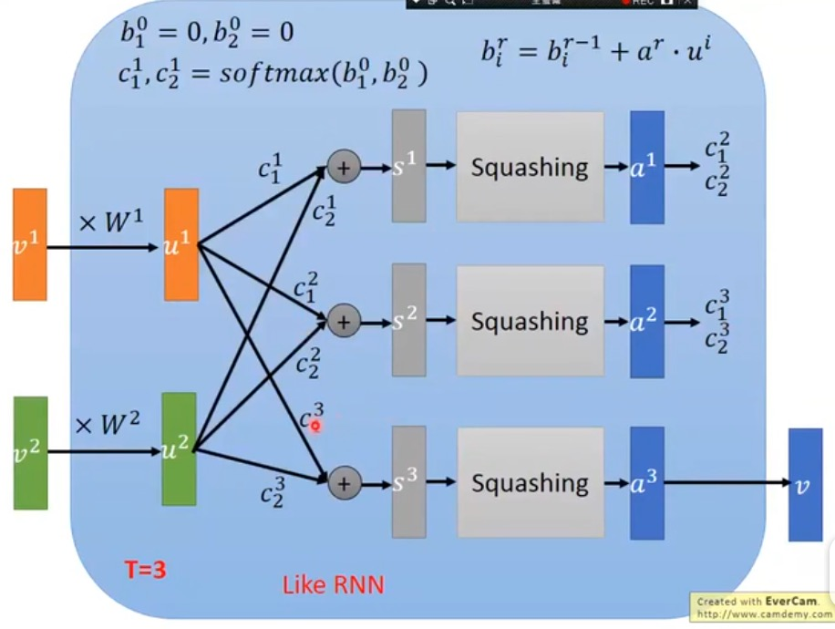

## 知识蒸馏
https://www.bilibili.com/video/BV1SC4y1h7HB?from=search&seid=9439205011855570419 

## 胶囊网络
https://www.bilibili.com/video/BV1eW411Q7CE?from=search&seid=15018787840603176667 
capsule主要是想取代neuron：capsule输出是vector，neuron输出是value。 
每一个neuron的任务是检测 一种特定的模式，capsule的vector代表了 某一种类模式。 

LAYER     | 操作
-------- | -----
u1=W1v1，u2=W2v2  | Wi是bp过程学习出来的(ui和vi都是vector)
s=c1u1+c2u2  | ci理解成pooling-根据上层输出决定(如果v和u很相近，下一次迭代的ci会增加)
v=Squash(s)  | v=|s|^2/(1+|s|^2)·s/|s|，Squash挤压只会改变s的长度、而不会改变s的方向

### Dynamic Routing
ci的确定过程有点类似排除异常点的过程，算出的v与哪些ui更接近，下一次迭代ci就会更倾向给哪些ui更大权重。 

